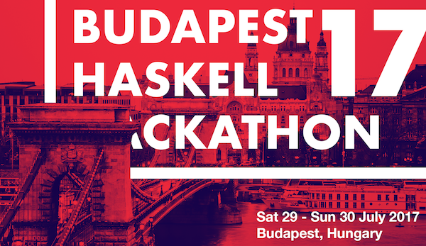

# Budapest Haskell Hackathon 2017

## Resources

You can find all the info about talks, projects, and the schedule on the event's [wiki][wiki], or [meetup][meetup] sites.
Additional resources will be uploaded shortly.

## Lightning talks

If you want to give a lightning talk on the event, create an issue on [this repo][gh_issues].

## Contact

You can contact us through the follwoing this [email][email].  
We have also a [slack][slack] that you can use during, and after the event.

[wiki]: https://wiki.haskell.org/Budapest_Hackathon_2017
[meetup]: https://www.meetup.com/Bp-HUG/events/240707746/
[gh_issues]: https://github.com/BP-HUG/bp-hackathon-2017/issues
[email]: mailto:budapest.hug@gmail.com
[slack]: https://bp-hug.slack.com
